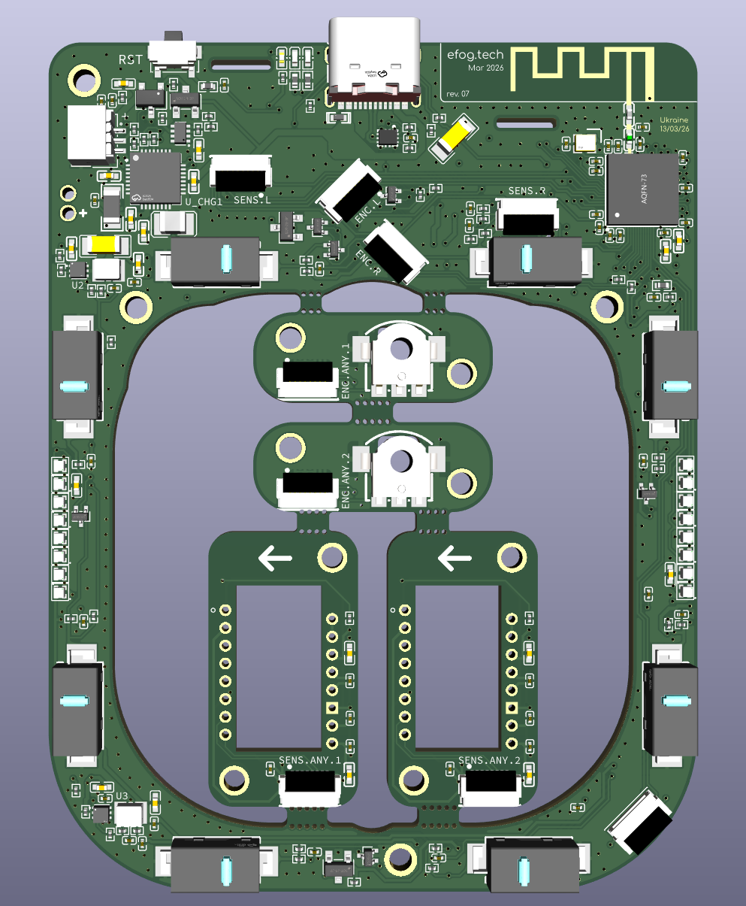

## Endgame Trackball (hardware)

| Revision | Type          | RGB LEDs | Consumption (idle/sleep) | C‑to‑C cable support | Additional exposed pins* | Notes                                      |
|------------|---------------|----------------|-------------|----------------------|--------------------------|--------------------------------------------------|
| rev3       | medium batch  | 🔴           | 🔴 480/130 uA        | ⚠️                    | ❌                        | Doesn't support the new (latest) encoders without a firmware modification. |
| rev4       | large batch   | 🟢           | 🔴 440/110 uA        | ⚠️                    | ❌                        | —                                                |
| rev5       | transitional  | 🟢           | 🟢 110/60 uA         | ✅                    | ❌                        | Restarts when USB power lost.                    |
| rev6       | transitional  | 🟢           | 🟢 95/50 uA          | ✅                    | ⚠️                        | The exposed pins are not very convenient to use. |
| rev7       | ~~final~~     | 🟢           | 🟢 95/50 uA          | ✅                    | ✅                        | The AXP2585 charging IC has got discontinued.    |
| rev8       | final (?)     | 🟢           | ?/? uA               | ✅                    | ✅                        | Specifications are to be measured.               |

*Additional 3 GPIOs for arbitrary user modifications. 

#### Why 6 layers?

Because it's cheaper than 4 layers. Yes, seriously.

#### Stackup

JLC06161H-3313

#### Also see

Parent repo: https://github.com/efogtech/endgame-trackball

